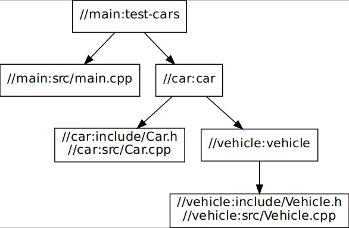

# Testing Bazel

Bazel is an open-source compiler that can be used as alternative of CMake for C++.

More information about it and about how to install it (I am using Ubuntu 20.04) at [Bazel](https://bazel.build/start)

# Overwrite

This repository is a simple container to test the [Bazel C++ tutorials](https://bazel.build/start/cpp) together with some custom tests.

Regarding the IDE, I am using VS Code + the [Bazel](https://marketplace.visualstudio.com/items?itemName=BazelBuild.vscode-bazel) extension and the usual other extension for C++.

# Setup

First, to get these tutorials execute:

```bash
git submodule update --init --recursive
```

They will be cloned in the `official_tutorials` folder, where we can found the C++ examples in the folder `cpp-tutorial`.

# Getting Started

Follow the Bazel basic tutorials [website](https://bazel.build/start/cpp) to complete the 3 basic example stages. Here, we learn how to create and compile our first package, executable, library and a second package which the first one depend.

Then, take a look to the main Bazel [concepts](https://bazel.build/concepts/build-ref).

# Testing

The folder `my_tests` contains the some Bazel tests performed by myself, using the information from the previous links together the info from the [Build Encyclopedia](https://bazel.build/reference/be/overview)

## Test 1

Simply creating a chain of dependencies: lib1 (Vehicle) -> lib2 (Car) -> main (using Car):



> Note: To generate this kind of images, simply install `xdot` and execute:
> `xdot <(bazel query --notool_deps --noimplicit_deps "deps(//main:test-cars)" --output graph)`

